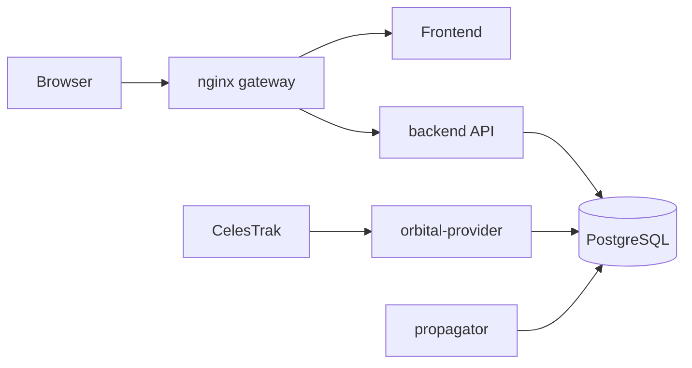

# WorldSat Monitor

[](https://github.com/ExoSpaceLabs/world-sat-monitor/actions/workflows/ci.yml)

**WorldSat Monitor** is an open, self-hosted satellite and constellation situational-awareness platform developed by **ExoSpaceLabs**. It combines public orbital data, backend propagation, persistent satellite/group management, and an interactive 3D Earth display in a service-oriented Docker Compose stack.

Current release: **v1.0.0**

[insert gif here]

## What v1 provides

- **Single-satellite display** with current propagated position, altitude, heading, latitude/longitude, illumination state, history, prediction, direction vector, and optional camera follow.
- **Constellation and group display** for provider-defined constellations and user-defined custom/mission groups.
- **Context-sensitive Details** showing satellite information in Single mode and aggregate collection information in Group mode.
- **Satellite Manager** with separate Single and Grouped workflows for catalog search, manual objects, monitoring lifecycle, constellation import, group creation, searchable membership editing, and collection removal.
- **3D globe visualization** using MapLibre with Dark, Street, and Satellite basemaps.
- **Space environment** with inertial star background, solar position, UTC Earth rotation, and day/night illumination.
- **Backend orbital propagation**. The browser renders products; it does not run the orbit propagator.
- **CelesTrak GP ingestion** plus a deterministic mock provider used by integration tests.
- **SGP4 propagation** from normalized OMM/GP-compatible orbital element sets.
- **Constellation-scale current-state queries** that avoid scanning detailed trajectory storage.
- **Persistent application settings** and PostgreSQL-backed satellite, group, provider, and propagation state.
- **Source-build and image-based Docker Compose deployment**.

WorldSat Monitor is intended as a lightweight engineering and mission-visualization layer. Public orbital data and SGP4 predictions are useful for tracking, planning, integration, demonstration, and situational awareness, but they are not a replacement for operator navigation products or authoritative flight-dynamics data.

## Quick start

### Published images

Clone the repository so the release Compose file is available locally, then start the stack in detached mode:

```bash
git clone https://github.com/ExoSpaceLabs/world-sat-monitor.git
cd world-sat-monitor
docker compose -f compose.images.yaml up -d
```

Docker Compose pulls the required published images automatically when they are needed.

Open the WorldSat Monitor UI at:

```text
http://localhost:3000
```

Useful runtime commands:

```bash
# Show service state
docker compose -f compose.images.yaml ps

# Follow service logs
docker compose -f compose.images.yaml logs -f

# Stop the detached stack and remove its containers/network
docker compose -f compose.images.yaml down
```

The release defaults to the version declared in `VERSION`. A deployment can explicitly pin an image version:

```bash
WORLDSAT_IMAGE_TAG=1.0.0 docker compose -f compose.images.yaml up -d
```

### Build from source

For development or local modification, from the cloned repository root:

```bash
docker compose up --build -d
```

The source Compose stack builds the frontend and shared Python backend image locally. Stop it with:

```bash
docker compose down
```

## User interface

The top-level display controls deliberately separate **viewing** from **management**.

### Single

Shows the active single-satellite list. Selecting an object changes the displayed spacecraft. The list remains a list; detailed information is shown independently in **Details**.

### Group

Shows imported constellations and user-created groups. Selecting a collection displays its available current-state members on the globe.

### Details

Details follows the selected display target.

For a satellite it includes information such as:

- altitude and heading;
- latitude and longitude;
- basemap and source state;
- propagated/interpolated position state;
- illumination state;
- follow-satellite control.

For a group it includes information such as:

- total and active members;
- positions currently ready;
- display coverage;
- group type and source;
- provider/source key;
- average altitude and altitude range;
- last synchronization time.

### Manager

The Manager has two workflows:

- **Single**: search provider catalogs, add manual objects, activate/deactivate monitoring, and remove inactive standalone satellites.
- **Grouped**: search/import provider constellations, create custom/mission groups, expand a collection to inspect or edit members, and remove a collection or its local satellites with guarded destructive actions.

Custom-group membership uses a searchable picker rather than a full catalog dropdown. Local candidates can be filtered by satellite name or NORAD identifier, active/inactive state, and whether they belong to a constellation. If a name or NORAD search has no local catalog match, the Manager falls back to CelesTrak and can import the result directly into the selected custom group.

A large constellation remains one collapsed Manager row until expanded, rather than turning the management interface into several thousand consecutive satellite rows.

### Orbital Settings

Single and Group display modes have separate orbital visualization settings. Single mode controls the selected spacecraft trajectory and marker behavior; Group mode controls the collection marker representation. Both modes use the same **Nadir / Orbit** placement language, and direction vectors use the same visual language in both modes.

### Map Settings

Map settings control basemap, space environment, day/night opacity, time scale, theme parameters, and scene reset behavior.

## Runtime architecture



The services have deliberately narrow ownership:

| Service | Responsibility |
| --- | --- |
| `gateway` | Same-origin ingress and API/frontend routing. |
| `frontend` | 3D visualization and user interaction. |
| `backend` | Client-facing satellite/group/settings/query API and interpolation of stored state. |
| `orbital-provider` | Orbital-source acquisition, normalization, deduplication, provider state, and propagation-job creation. |
| `propagator` | SGP4 execution and storage of propagation runs, trajectory samples, and current state. |
| `db` | PostgreSQL durable state and propagation-job queue. |

`backend`, `orbital-provider`, and `propagator` currently share the same Python container image, but run as independent services with separate entry points.

## Orbital data model

A satellite has an internal WorldSat Monitor database identity. External catalog identifiers are attributes stored separately, including namespaces such as:

- `NORAD_CAT_ID`
- `COSPAR`
- future provider-specific identifiers

Orbital source data is stored as immutable, normalized **orbital element sets**. The canonical model is OMM/GP compatible and does not require raw two-line TLE columns. TLE remains a supported source representation where appropriate, including migration of legacy data.

The provider flow is:

```text
active satellite
    -> provider selection
    -> GP/OMM-compatible normalization
    -> fingerprint/deduplication
    -> orbital_element_sets
    -> propagation_jobs
```

The propagation flow is:

```text
propagation_jobs
    -> SGP4
    -> propagation_runs
    -> position_samples
    -> satellite_current_state
    -> backend API
    -> frontend
```

Current-state and detailed trajectory workloads are intentionally separated. `satellite_current_state` provides one fast current record per satellite for large group displays, while `position_samples` stores history/prediction products for selected-object trajectory queries.

## Groups and constellations

WorldSat Monitor supports two collection concepts:

- **Provider constellations**, imported from supported external catalog group definitions such as CelesTrak groups.
- **User groups**, created locally for custom or mission-oriented selections.

Group membership is separate from satellite identity. A satellite can participate in multiple collections. Removing membership therefore does not imply deleting the spacecraft record. Destructive collection purges are explicit and guarded.

Large collection display uses batched current-state access and a single browser canvas overlay for group markers, avoiding thousands of individual DOM marker nodes.

## Basemaps and environment

v1 provides:

- **Dark**: themed Esri Dark Gray raster base/reference layers, with configurable base color and contrast treatment.
- **Street**: OpenStreetMap standard raster tiles.
- **Satellite**: Esri World Imagery with OpenFreeMap-derived label/symbol overlays.

The environment layer adds a star field, solar position, UTC-based Earth rotation, and a WebGL day/night illumination pass. Map attribution remains visible for the active source.

See [`docs/basemap-contrast.md`](docs/basemap-contrast.md) and [`docs/orbit-display.md`](docs/orbit-display.md).

## API examples

With the stack running on port 3000:

```bash
curl http://localhost:3000/api/v1/health
curl http://localhost:3000/api/v1/settings
curl http://localhost:3000/api/v1/satellites
curl "http://localhost:3000/api/v1/satellites?active=true"
curl http://localhost:3000/api/v1/groups
curl http://localhost:3000/api/v1/satellites/999999999/position
curl "http://localhost:3000/api/v1/satellites/999999999/track?resolution_seconds=60"
```

`WORLDSAT-01` / `NORAD_CAT_ID=999999999` is a deliberately synthetic object used to validate the complete provider -> propagation -> API -> frontend path without depending on an external service.

## Configuration

Important worker settings include:

```text
PROVIDER_POLL_SECONDS
PROVIDER_REFRESH_SECONDS
CELESTRAK_ENABLED
CELESTRAK_BASE_URL
CELESTRAK_CATALOG_URL
PROPAGATION_HISTORY_HOURS
PROPAGATION_HORIZON_DAYS
PROPAGATION_STEP_SECONDS
PROPAGATION_NEAR_HORIZON_HOURS
PROPAGATION_MID_HORIZON_HOURS
PROPAGATION_MID_STEP_SECONDS
PROPAGATION_FAR_STEP_SECONDS
PROPAGATION_SAMPLE_RETENTION_HOURS
PROPAGATION_CLEANUP_INTERVAL_SECONDS
PROPAGATION_CLEANUP_BATCH_SIZE
```

Application map/orbit settings are persisted separately by the backend.

## Development and validation

CI runs on `develop`, `main`, and pull requests. The release gate includes:

- frontend lint, build, tests, benchmark, and production-artifact validation;
- backend/provider/propagator unit tests;
- SGP4/provider normalization tests;
- legacy PostgreSQL schema migration;
- constellation-scale backend and frontend performance checks;
- full Docker Compose provider + propagator + API integration.

Local frontend checks:

```bash
cd frontend
npm ci
npm run lint
npm test
npm run benchmark:groups
npm run validate:artifact
```

Local backend tests:

```bash
python -m pip install -r backend/requirements.txt
PYTHONPATH=backend python -m unittest discover -s backend/tests -v
```

## Release and container publication

`develop` is the integration branch. It **never publishes release images**.

Container publication is triggered only after the `CI` workflow completes successfully for a commit on `main`. That workflow publishes multi-architecture (`linux/amd64`, `linux/arm64`) images for:

```text
ghcr.io/exospacelabs/world-sat-monitor-frontend
ghcr.io/exospacelabs/world-sat-monitor-backend
```

The backend image is reused by the API, orbital-provider, and propagator services.

See [`docs/deployment.md`](docs/deployment.md) for the release/deployment contract.

## Documentation

- [`docs/architecture.md`](docs/architecture.md) - service, data, provider, propagation, and collection architecture.
- [`docs/orbit-display.md`](docs/orbit-display.md) - single/group rendering and environment behavior.
- [`docs/basemap-contrast.md`](docs/basemap-contrast.md) - basemap sources and visualization contrast policy.
- [`docs/performance.md`](docs/performance.md) - constellation current-state, trajectory-storage, benchmark, and retention policy.
- [`docs/deployment.md`](docs/deployment.md) - source and GHCR image deployment plus release publication rules.

## Project

- **Project:** WorldSat Monitor
- **Version:** v1.0.0
- **Organization:** ExoSpaceLabs
- **Repository:** https://github.com/ExoSpaceLabs/world-sat-monitor
- **Contact:** exospacelabs@gmail.com
- **License:** Apache-2.0
