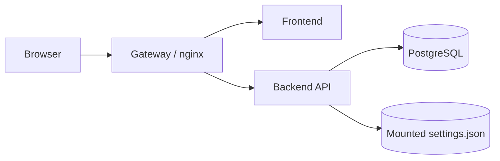
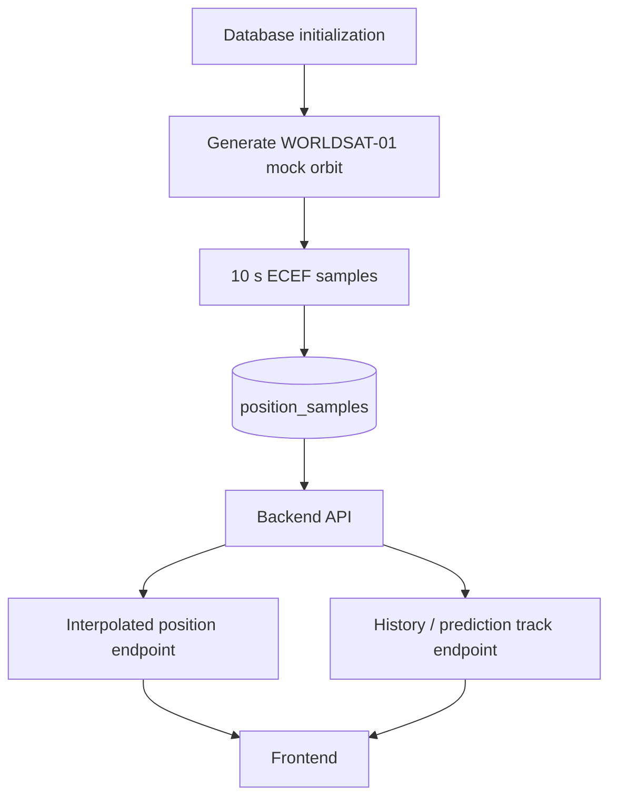
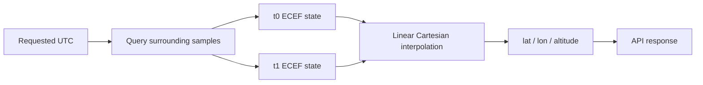
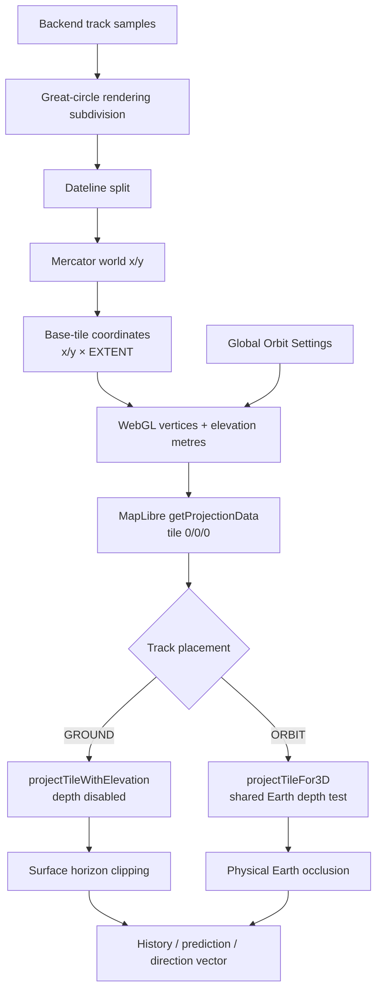
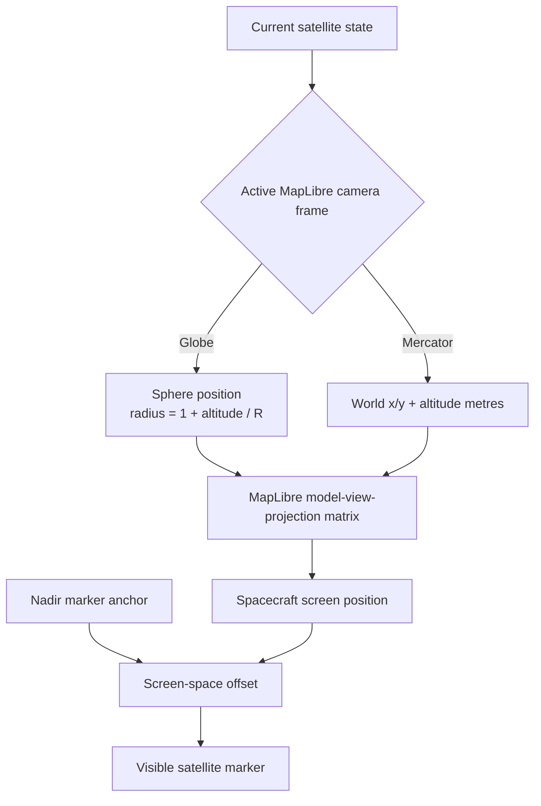
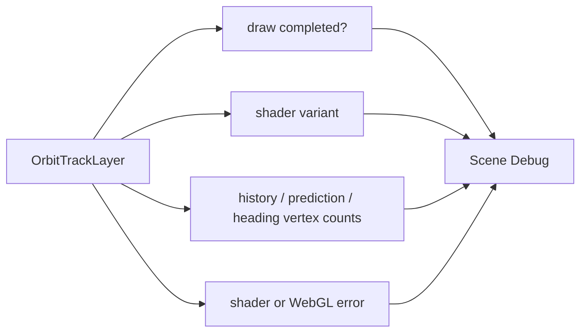
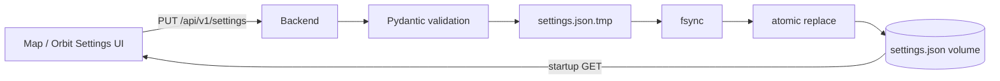
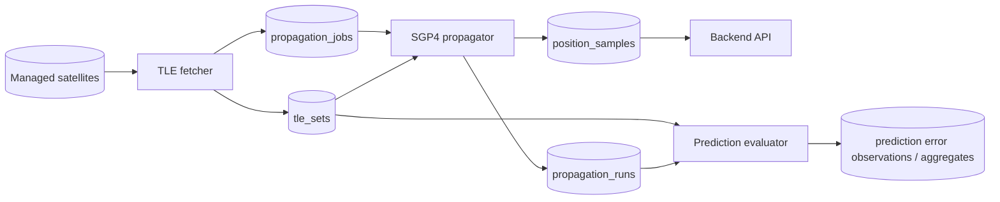
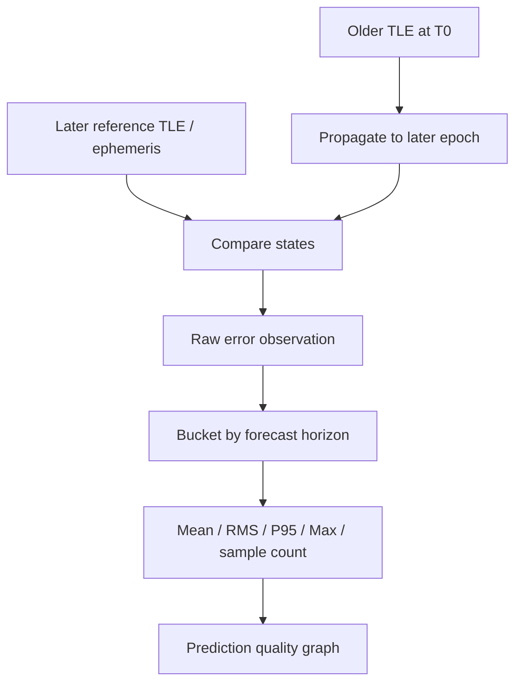
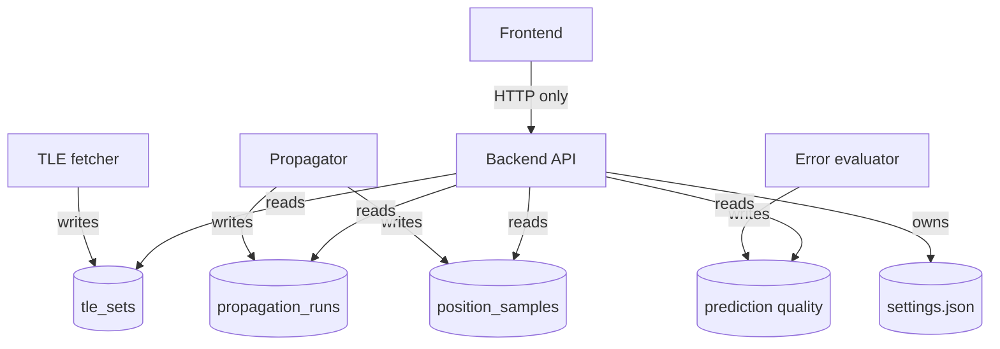

# WorldSat Monitor architecture

WorldSat Monitor is split into independently deployable frontend, backend, database, and gateway services. The backend owns orbital data access and interpolation; the frontend owns visualization and user interaction.

## Runtime topology

The browser talks to one same-origin gateway. The frontend never needs Docker-internal service names and the backend remains the API boundary for satellite state and persistent application settings.

## Current mock-orbit flow

The mock orbit exists so API and rendering work can proceed independently of the future TLE acquisition and SGP4 services.

## Position interpolation

Interpolation is performed in Cartesian ECEF coordinates rather than directly interpolating longitude. This avoids discontinuities at the ±180 degree meridian.

## Orbit display rendering

Orbit settings are global. Every tracked satellite shares path history/prediction lengths, refresh cadence, interpolation cadence, direction-vector visibility, and track-placement mode.

The orbit custom layer is declared as **3D** so MapLibre exposes the scene depth buffer, but the two display modes intentionally consume it differently. `GROUND` remains a readable surface overlay: depth testing is disabled and MapLibre's surface-horizon projection is used. `ORBIT` preserves real clip-space depth and keeps MapLibre's 3D depth test, so trajectory segments disappear only when the rendered Earth is actually in front of them.

This distinction matters because MapLibre's `projectTileWithElevation(...)` intentionally replaces clip-space Z with a synthetic globe-horizon clipping value. That is correct for objects constrained to the surface, but it clips an elevated spacecraft trajectory too early. `projectTileFor3D(...)` preserves the real depth required for orbital geometry.

The custom-layer tile projection consumes physical elevation in metres. The frontend therefore stores one altitude representation and leaves projection scaling to MapLibre.

### Satellite marker projection

The satellite DOM marker is still anchored at its nadir longitude/latitude for interaction, but its visible element is translated to the actual 3D projected spacecraft location.

This removes the previous radial pixel approximation. The current marker, heading-vector origin, history endpoint, and prediction origin now use the same physical altitude model, so a propagated point at the satellite timestamp should visually intersect the satellite marker.

Far-side marker visibility is handled separately with a finite camera-to-satellite ray/sphere test. It dims only when Earth actually intersects that line of sight.

The frontend never derives authoritative orbital states during rendering. Great-circle subdivision only adds display vertices between backend samples so long line segments follow the globe smoothly.

### Runtime orbit diagnostics

The custom layer reports its actual rendering state to Scene Debug:

This distinguishes an empty track from a renderer that failed to install, compile, or draw. A missing orbit overlay therefore has an observable failure state rather than silently disappearing.

## Persistent settings

Persistent configuration contains map and global orbit-display settings. Runtime interaction state such as the currently selected satellite or active camera drag is deliberately not stored in the settings document.

Reset operations write default values back to the same mounted JSON configuration rather than keeping a second hidden source of truth.

## Planned TLE and propagation pipeline

The backend API is a read/query service. TLE collection and propagation are separate workers so provider latency, scheduled updates, or long-running propagation cannot block browser requests.

PostgreSQL can initially act as the propagation job queue using row locking such as `FOR UPDATE SKIP LOCKED`. A dedicated broker is unnecessary until throughput or delivery guarantees demonstrate that one is actually required.

## Prediction quality model

A newly published TLE is not ground truth. Prediction quality is therefore described as disagreement against a later reference state, initially a newer TLE and eventually a higher-quality ephemeris if one becomes available.

This allows users to see how uncertainty tends to grow with forecast horizon without presenting a TLE-derived comparison as absolute navigation truth.

## Data ownership

Service ownership should remain narrow. In particular, the frontend does not propagate TLEs and the backend request process does not become the scheduler/propagator by convenience.
