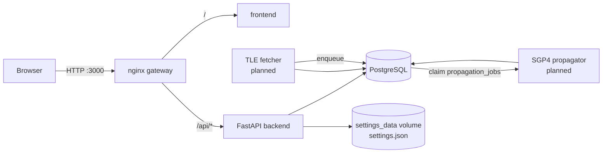
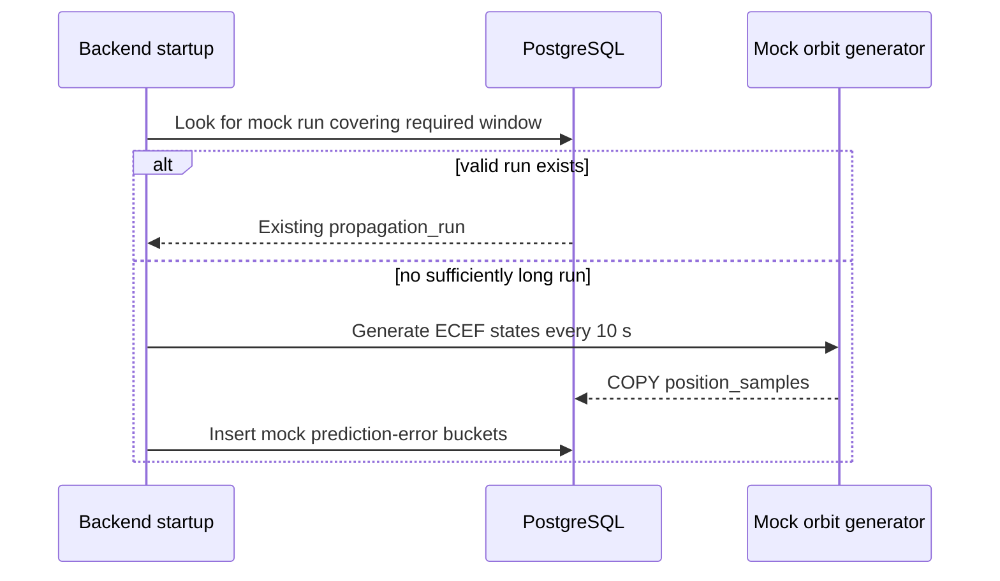
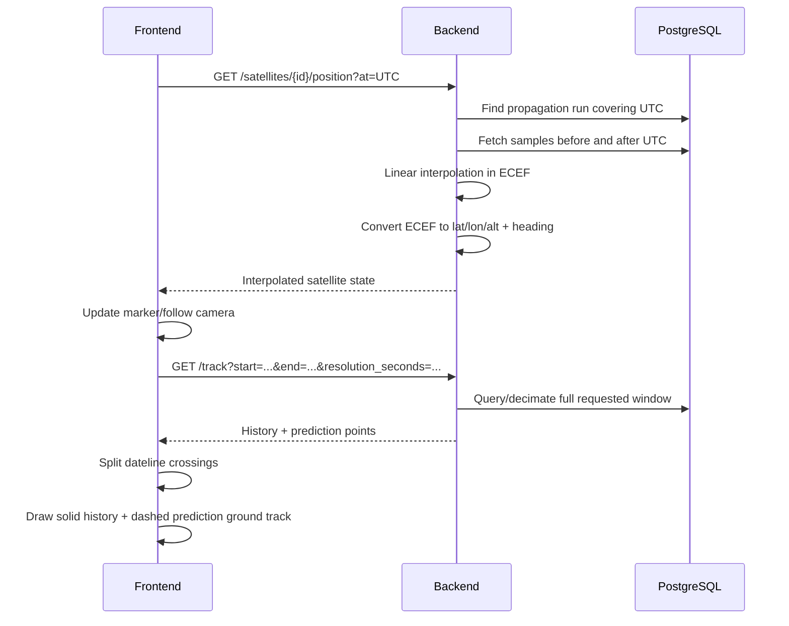
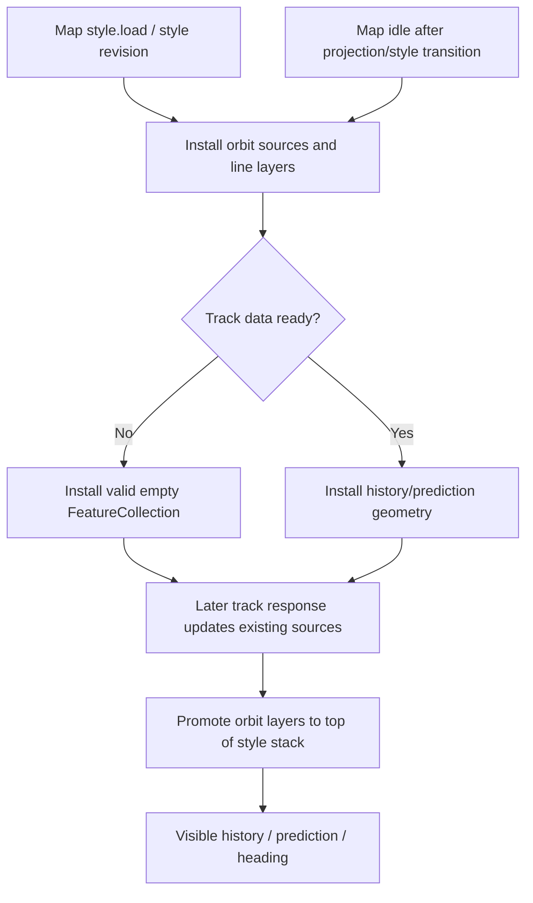
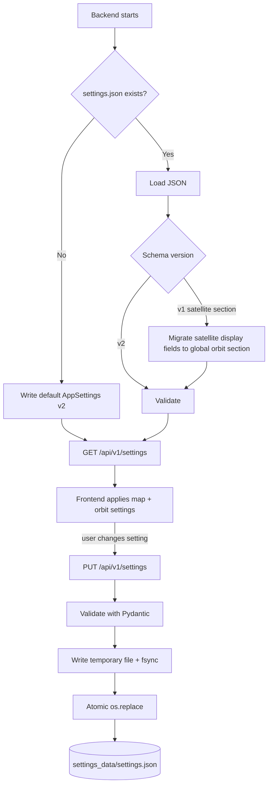
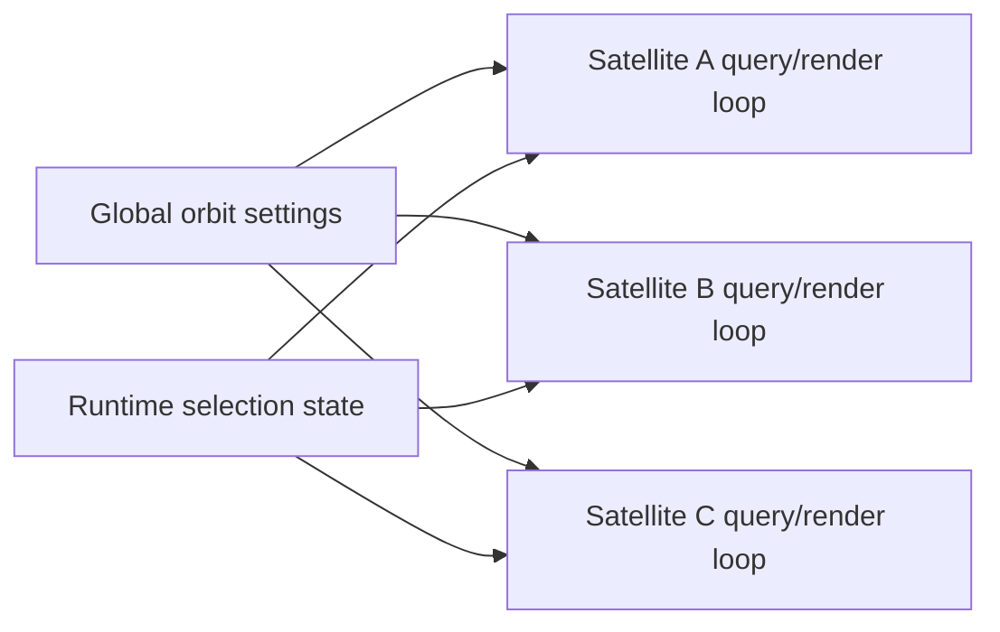
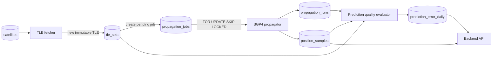

# WorldSat Monitor service architecture

This document describes the runtime services, data ownership, frontend query flow, persistent configuration, render-layer ownership, and the planned TLE/propagation pipeline.

## Runtime topology

### Current services

- `frontend`: 3D mission UI. It renders satellite state, history/prediction ground tracks, environment layers, and controls. It does not own authoritative orbital propagation.
- `backend`: FastAPI query/interpolation service. It reads dense state from PostgreSQL and owns the persistent JSON configuration file.
- `db`: PostgreSQL catalogue, TLE, propagation, state-sample, and prediction-quality store.
- `gateway`: nginx front door. `/` is routed to the frontend and `/api/` to the backend, keeping browser requests same-origin.
- `settings_data`: Docker volume mounted at `/data` in the backend. The backend reads and atomically rewrites `/data/settings.json`.

## Current mock-data flow

`WORLDSAT-01` (`NORAD 99001`) is generated by the backend bootstrap path until the real TLE services exist.

The mock dataset provides 48 hours of historical samples, 360 hours (15 days) of future samples, and a 10-second raw cadence. The extra day around the frontend limit gives the running application room to advance in UTC without rebuilding the mock run on every restart.

## Browser position and track flow

The position request cadence and path refresh cadence are independent. Raw propagated samples are stored in ECEF Cartesian coordinates plus cached geodetic coordinates. Direct longitude interpolation is deliberately avoided because it fails at the ±180° meridian.

A 14-day prediction at 10-second cadence contains 120,960 samples per satellite. The track endpoint can increase the effective response step to remain under the point limit while preserving the complete requested time window. The frontend separately splits line strings at longitude wrap crossings.

## Orbit overlay rendering

Satellite markers and orbit lines use two different MapLibre mechanisms. The marker is a DOM marker; history, prediction, and heading are MapLibre GeoJSON line layers.

The installer must not assume the first track request has completed. Empty `MultiLineString` data is avoided because MapLibre does not accept that form consistently. A valid empty `FeatureCollection` keeps the source and layer alive until the first track response arrives.

The installer also retries after `style.load` and `idle`. Basemap changes replace MapLibre style state, so orbit layers are recreated after every style revision. Orbit layers are explicitly promoted above the day/night illumination layer so the overlay remains legible on the night side.

## Persistent settings

All durable display configuration is stored in one versioned JSON document. Transient interaction state such as camera position, follow mode, or which satellite is currently selected is intentionally not persisted.

### Settings ownership

Version 2 contains two persistent sections:

- `map`: basemap, space environment, shadow opacity, debug state, and simulation time scale.
- `orbit`: **global** orbit rendering/query policy shared by every tracked satellite. It contains history length, future prediction length, requested path step, path refresh cadence, and position interpolation request cadence.

There is deliberately no `selected_norad_id` in persistent configuration. Satellite selection belongs to runtime UI state and will eventually come from the catalogue/selection workflow. A user changing orbit history from 90 minutes to 6 hours changes it for every satellite, not one specific object.

Existing version-1 files are migrated automatically. The legacy `satellite.position_update_ms` and `satellite.path` values are retained under `orbit`; the old selected NORAD field is discarded. The normalized version-2 document is then atomically written back to `/data/settings.json`.

Panel reset operations replace their relevant section with defaults and persist the normalized full document. `POST /api/v1/settings/reset` resets the whole file. The committed `config/settings.example.json` documents the current schema.

## Planned multi-satellite rendering

The shared orbit configuration is designed to apply to multiple tracked objects without introducing per-object duplicates:

Object identity, selection, visibility, and constellation membership are catalogue/session concerns. Orbit display cadence and path lengths are application-wide policy.

## Planned TLE and propagation pipeline

### TLE fetcher

The fetcher loads managed satellites, obtains newer TLEs, inserts immutable `tle_sets` rows, and enqueues `propagation_jobs`. It does not propagate or serve user-facing position queries.

### Orbit propagator

The propagator claims pending jobs with `FOR UPDATE SKIP LOCKED`, runs SGP4 at the configured raw cadence, stores `propagation_runs` and `position_samples`, and marks each job completed or failed.

### Prediction-quality evaluator

When a newer reference TLE arrives, the evaluator compares states produced by older propagation runs against states derived from the later reference at equal timestamps. Results are aggregated by forecast horizon. A later TLE is not ground truth, so the UI describes these values as prediction disagreement/error estimates. A future evaluator should retain radial, along-track, and cross-track components in addition to total 3D error.

## API surface

- `GET /api/v1/health`
- `GET /api/v1/settings`
- `PUT /api/v1/settings`
- `POST /api/v1/settings/reset`
- `GET /api/v1/satellites`
- `GET /api/v1/satellites/{norad_id}/position?at=<UTC timestamp>`
- `GET /api/v1/satellites/{norad_id}/track?start=<UTC>&end=<UTC>&resolution_seconds=60`
- `GET /api/v1/satellites/{norad_id}/prediction-error`

## Data ownership

| Resource | Owner | Notes |
|---|---|---|
| `satellites` | backend/admin pipeline | managed object catalogue |
| `tle_sets` | TLE fetcher | append-only source observations |
| `propagation_jobs` | fetcher/propagator | PostgreSQL-backed work queue |
| `propagation_runs` | propagator | immutable propagation products |
| `position_samples` | propagator/mock seed | dense orbital state |
| `prediction_error_daily` | quality evaluator | horizon quality statistics |
| `/data/settings.json` | backend settings API | persistent map + global orbit configuration |
| selected satellite | frontend/catalogue workflow | transient runtime state, not global configuration |
| camera/follow interaction | frontend | transient session state |

The frontend never writes orbital tables directly.
