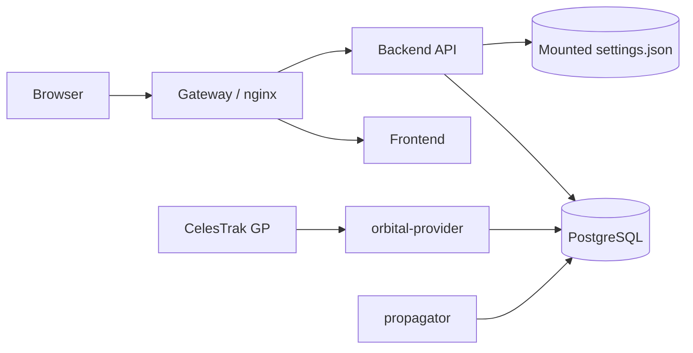
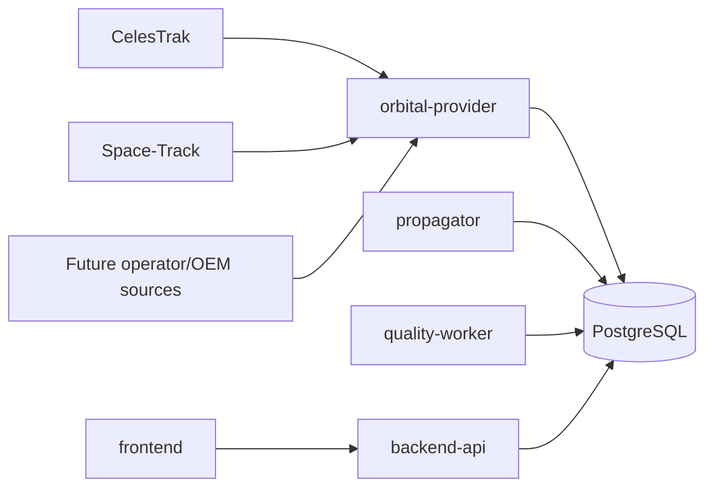
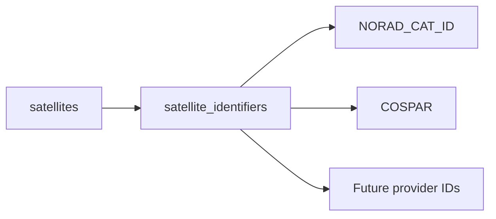
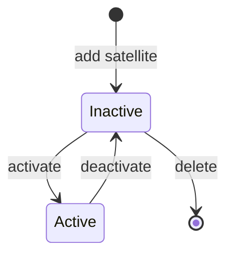
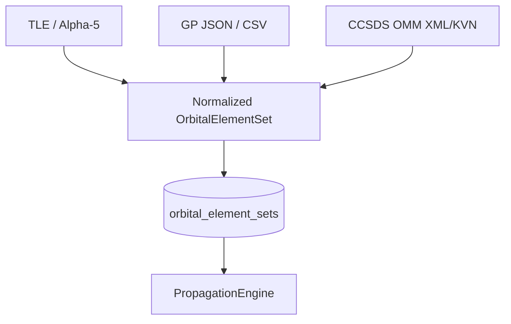
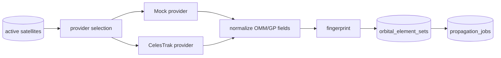
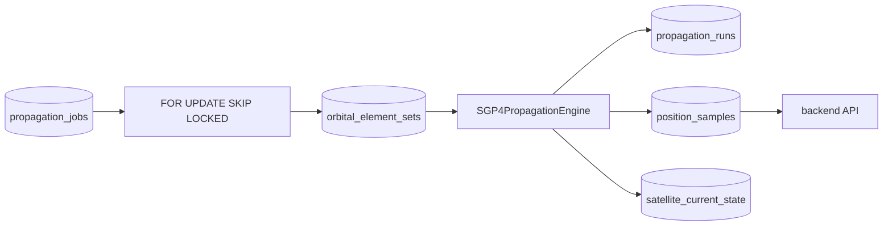

# WorldSat Monitor architecture

WorldSat Monitor separates catalog management, external orbital-data acquisition, propagation, query APIs, and visualization. The boundary is intentional: the UI never becomes an orbit propagator, the user-facing backend never becomes a scheduled provider worker, and orbital workers never depend on browser state.

## Runtime topology

Current topology:



Planned extensions add more provider adapters and the independent quality evaluator:



One PostgreSQL service remains the initial durable store. Service separation does not require distributed databases or a message broker at this stage. PostgreSQL is also the propagation-job queue, with workers claiming rows through `FOR UPDATE ... SKIP LOCKED`.

The `backend`, `orbital-provider`, and `propagator` containers currently share the same Python image/package but use separate entry points and runtime responsibilities.

## Service ownership

| Component | Writes | Reads | Responsibility |
| --- | --- | --- | --- |
| `frontend` | none directly | backend API | visualization and interaction |
| `backend` | catalog lifecycle + settings | stored propagation products | client-facing API and interpolation |
| `orbital-provider` | provider state, orbital elements, propagation jobs | active satellites/identifiers | external acquisition and normalization |
| `propagator` | job state, runs, samples, current state | queued jobs + orbital elements | orbital computation |
| `db` | durable state | n/a | shared persistent store |
| `gateway` | none | frontend/backend | ingress |

The backend never calls CelesTrak and never executes SGP4 in a request path. The provider never creates position samples. The propagator never serves browser requests.

## Satellite identity and lifecycle

A WorldSat Monitor satellite has an internal database ID. External identities are attributes, not primary keys.



Monitoring state is persisted independently from runtime map selection:



Inactive means metadata and history are retained, the provider does not schedule acquisition, and pending propagation work is cancelled. Active means the provider keeps source data current and ensures propagation work exists when a new usable element set is accepted. Deactivation never deletes orbital history.

## Orbital source model

The pre-#12 schema treated a two-line TLE record as the domain object. The canonical model is now an orbital element set with OMM/GP-compatible fields:



`orbital_element_sets` stores source provenance, source format, mean-element theory, SGP4-relevant mean elements, provider fingerprint, and the original provider payload. TLE lines may exist inside `raw_payload` for a migrated or TLE-sourced record, but `line1`/`line2` are not required database columns.

## Provider pipeline

The provider service processes active satellites only.



Provider responsibilities are:

- select the configured source;
- determine whether a refresh is due;
- fetch external data or deterministic mock data;
- validate and normalize OMM/GP fields;
- retain the original payload;
- fingerprint normalized orbital content;
- insert a new immutable element set only when content changed;
- ensure exactly one active propagation job exists for a source element set;
- retain per-satellite/provider fetch status and errors.

Provider failures are isolated from the backend. A failed CelesTrak request records provider state but does not make the API unavailable.

## Deterministic mock provider

`WORLDSAT-01` is a permanent synthetic integration target rather than a temporary fake-position generator.

```text
satellites / WORLDSAT-01
NORAD_CAT_ID = 999999999
provider_preference = mock
        ↓
MockOrbitalDataProvider
        ↓
fixed valid OMM-compatible elements
        ↓
normal element-set persistence and fingerprinting
        ↓
normal propagation job
        ↓
normal SGP4 worker
```

`999999999` is reserved only inside WorldSat Monitor and is not claimed to be an official USSF/NORAD catalog assignment. The provider always returns the same orbital data, so repeated polling validates deduplication and does not create redundant element sets.

Current `python-sgp4` releases constrain the internal `Satrec.satnum` metadata field to `0..339999`, while OMM/catalog identifiers can exceed that range. The propagation adapter therefore preserves the real identifier in the OMM/raw database record but substitutes local sentinel `0` only when initializing `Satrec` with an out-of-range catalog number. This does not change orbital dynamics because satellite number is identity metadata, not an SGP4 state parameter.

## Propagation pipeline



The `PropagationEngine` abstraction owns orbit calculation. `SGP4PropagationEngine` is the first implementation, initialized from normalized OMM-compatible fields.

A claimed job transitions from `pending` to `running`. The propagator:

1. reloads its source element set;
2. verifies the satellite is still active;
3. constructs the configured history/future time window;
4. initializes SGP4 once for the element set;
5. propagates samples across the window;
6. writes `position_samples` and the traceable `propagation_run`;
7. upserts `satellite_current_state` for the generated current timestamp;
8. commits the run and job as completed atomically.

Failures mark only the claimed job failed. Deactivation before or during work marks the job cancelled rather than producing new monitoring data for an inactive satellite.

## Coordinate handling

SGP4 produces TEME position/velocity. The current worker applies a Vallado-style GMST rotation, using UTC as the UT1 approximation for visualization, to obtain ECEF coordinates. The existing geographic conversion is currently spherical-Earth based and can later be upgraded independently of the SGP4 provider/worker boundaries.

The API interpolates requested times in Cartesian ECEF coordinates rather than interpolating longitude, avoiding discontinuities at the ±180° meridian.

## Current-state versus trajectory storage

`position_samples` is the trajectory/history/prediction product used for detailed range queries.

`satellite_current_state` is a separate one-row-per-satellite product intended for fast current-position queries once many satellites and constellations are rendered together.

This avoids forcing future constellation views to search large trajectory tables simply to answer “where is everything now?”. Partitioning/retention and large-constellation tuning remain part of the dedicated scaling issue.

## Legacy schema migration

When any Python service starts against the previous TLE-centric schema, the migration layer serializes changes using a PostgreSQL advisory transaction lock and converts the old model before applying additive worker schema changes:

```text
satellites.norad_id -> satellite_identifiers[NORAD_CAT_ID]
tle_sets -> orbital_element_sets (source_format=TLE, raw_payload={line1,line2})
propagation_runs.source_tle_id -> source_element_set_id
propagation_jobs.tle_id -> element_set_id
prediction_error_daily.reference_tle_id -> reference_element_set_id
```

The current additive migration also introduces `provider_fetch_state`, `satellite_current_state`, propagation history-window configuration, cancelled job state, and active-job deduplication.

CI executes the legacy migration against a real PostgreSQL fixture and verifies data/reference preservation.

## Backend API ownership

The backend owns client-facing application operations: satellite CRUD, activate/deactivate lifecycle transitions, position/track queries and decimation, settings, and future group/quality queries.

Position and track compatibility endpoints currently resolve satellites by `NORAD_CAT_ID`. Management endpoints use the internal satellite ID, keeping domain identity independent from catalog identifiers.

The backend can interpolate stored ECEF samples to satisfy an arbitrary query timestamp, but it does not run an orbital propagator to answer requests.

## Frontend ownership

The frontend owns visualization and user interaction. The satellite panel includes local catalog management: list active and inactive satellites, add metadata/identifiers manually, activate/deactivate monitoring, and delete inactive entries. Runtime display selection remains separate from persisted monitoring state.

`GROUND` mode uses surface placement and horizon clipping. `ORBIT` mode preserves actual altitude/depth so trajectory segments disappear only when Earth physically occludes them. Satellite marker occlusion uses a finite camera-to-satellite ray/sphere test.

## Worker health

`orbital-provider` and `propagator` each expose a small internal HTTP health endpoint on their own container port. Health records service identity and recent cycle success/failure independently of the FastAPI backend. Compose and CI use these endpoints directly.

## Prediction quality

Prediction-quality records reference generalized orbital element sets rather than TLE rows. A later GP/OMM set remains an estimate, not ground truth. `reference_kind` and element-set provenance allow future OEM/operator/GNSS references without changing the basic quality model. The future `quality-worker` remains separate from both acquisition and propagation.

## CI contract

`develop` and `main` both run CI. The development gate includes:

- frontend lint/build/tests/artifact validation;
- backend/provider/propagator compile and unit tests;
- provider fixture parsing and malformed/failure tests;
- SGP4 validation against the published Vanguard reference vector;
- propagation of the large synthetic WorldSat catalog identifier through the SGP4 compatibility adapter;
- real PostgreSQL migration from the legacy TLE schema;
- full Compose startup and worker health;
- deterministic mock provider -> normalized element -> propagation job -> SGP4 -> run/samples/current-state -> backend API integration;
- element-set deduplication checks;
- satellite lifecycle checks proving inactive satellites are ignored and deactivation leaves no active propagation job.

Features remain on `develop` until this integration path is stable, then merge to `main`.
