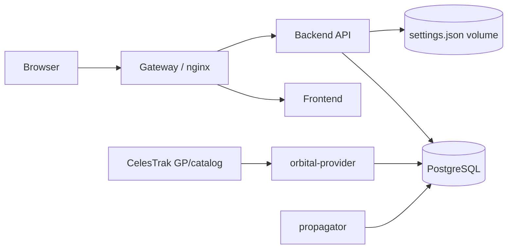
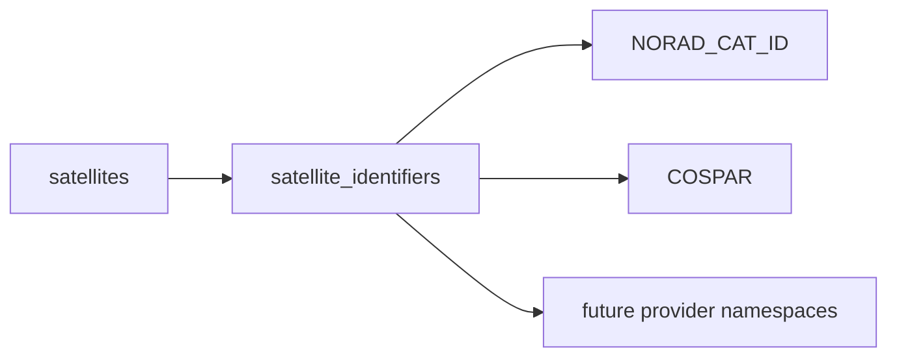
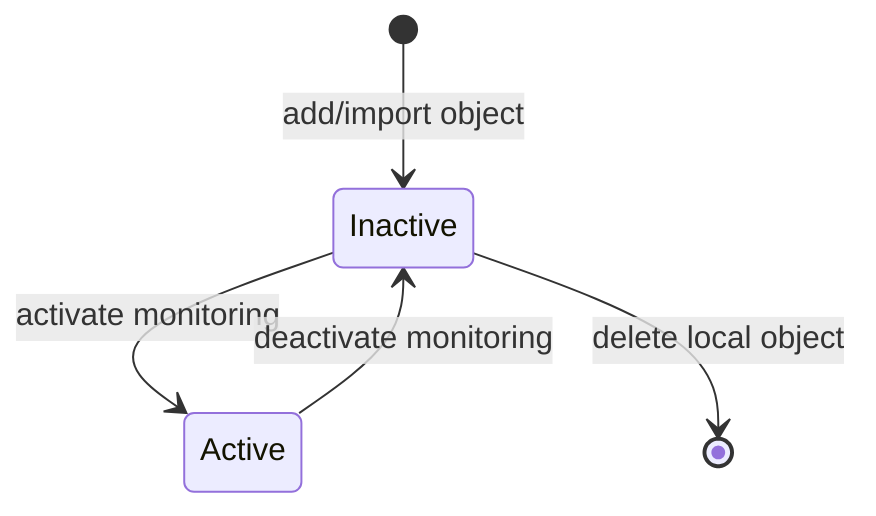
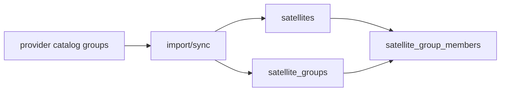
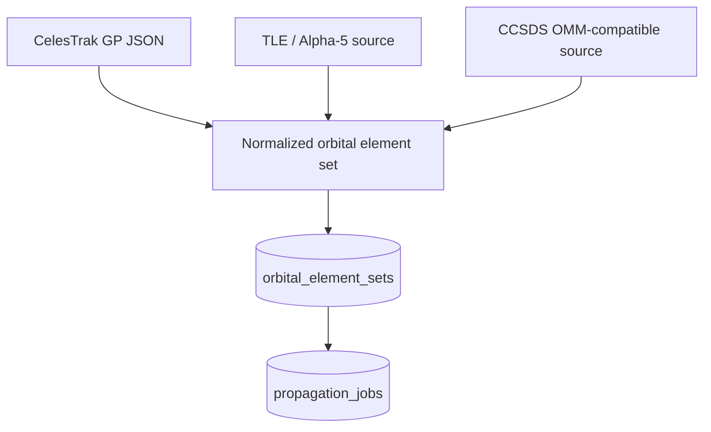
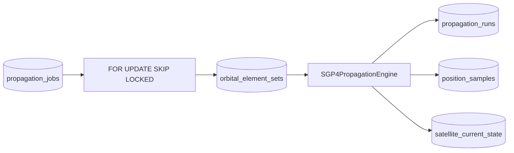

# WorldSat Monitor v1 architecture

WorldSat Monitor separates orbital acquisition, propagation, persistent state, query APIs, and visualization. The browser is deliberately a rendering and interaction client: it does not fetch provider data directly and it does not run SGP4.

## Runtime topology

The Docker Compose services are:

| Service | Responsibility |
| --- | --- |
| `gateway` | Same-origin ingress. Routes frontend and `/api/` traffic. |
| `frontend` | MapLibre globe, single/group visualization, panels, manager, and user interaction. |
| `backend` | Client-facing satellite/group/settings/query API and interpolation of stored orbital state. |
| `orbital-provider` | Provider polling, catalog/orbital acquisition, normalization, deduplication, provider state, and propagation-job creation. |
| `propagator` | Claims propagation jobs, executes SGP4, stores runs/trajectory/current state, and performs trajectory retention. |
| `db` | PostgreSQL persistent state and propagation-job queue. |

The API, provider, and propagator currently use the same Python package/container image, but they are independent processes with separate entry points and runtime ownership.

## Service boundaries

These boundaries are intentional:

- the browser does not propagate orbits;
- the backend request process does not call CelesTrak;
- the provider does not generate trajectory samples;
- the propagator does not serve browser requests;
- PostgreSQL owns durable state and also coordinates propagation work;
- external-provider failures do not make the user-facing API unavailable.

This keeps the v1 stack small while preserving clear seams for future provider, propagation, telemetry, and mission-system adapters.

## Satellite identity

A satellite has an internal WorldSat Monitor database ID. External identities are attributes rather than primary keys.

This allows a spacecraft to carry several identifiers without coupling the database model to one catalog provider.

## Monitoring lifecycle

Monitoring state is independent from map selection.

`active=true` means the provider and propagator should maintain useful orbital state for that object. Deactivation is non-destructive: metadata and historical records remain, pending propagation work is cancelled, and new provider work is not scheduled until reactivation.

A satellite may be displayed without changing its database identity, and display selection does not redefine monitoring state.

## Groups and constellations

v1 has a first-class collection model:

Collections may be:

- provider-backed constellations;
- user-created custom groups;
- user-created mission-oriented groups.

Membership is separate from satellite existence. The same satellite can belong to more than one group. Removing one membership therefore does not delete the satellite.

The Manager reflects this ownership model:

- **Single** manages standalone/catalog objects and monitoring state;
- **Grouped** imports provider constellations and manages collections/memberships;
- large constellations remain collapsed until explicitly expanded;
- destructive collection purges are explicit and blocked while members are active.

## Orbital source model

The canonical orbital record is a normalized, immutable orbital element set rather than mandatory raw TLE lines.

`orbital_element_sets` stores:

- source/provider provenance;
- source format and mean-element theory;
- SGP4-relevant OMM/GP fields;
- provider fingerprint for deduplication;
- original provider payload;
- immutable association with the satellite.

TLE remains a possible source representation and legacy rows can be migrated, but line 1/line 2 are not the canonical database schema.

## Provider pipeline

For each active satellite, `orbital-provider`:

1. chooses the configured provider;
2. checks whether acquisition is due;
3. fetches external or deterministic mock data;
4. validates and normalizes the response;
5. fingerprints normalized orbital content;
6. inserts a new element set only when orbital content changed;
7. creates/ensures propagation work for the accepted element set;
8. records provider status/errors independently of the API process.

CelesTrak GP/JSON is the public provider implemented in v1. A deterministic mock provider drives integration tests without network dependency.

## Propagation pipeline

PostgreSQL is used as the propagation-job queue. Workers claim rows with `FOR UPDATE ... SKIP LOCKED`, allowing concurrent workers without duplicate ownership of the same pending job.

A propagation run:

1. reloads the source element set;
2. verifies the satellite is still active;
3. creates the configured history/prediction time window;
4. initializes SGP4 from normalized mean elements;
5. propagates the tiered sampling grid;
6. stores trajectory samples and run provenance;
7. updates the one-row current-state product;
8. marks the job complete atomically with its products.

The `PropagationEngine` abstraction keeps SGP4 as the first engine rather than making it the architectural boundary. Future OEM/state-vector products can therefore be introduced without moving propagation into the API or browser.

## Current state versus trajectory state

WorldSat Monitor intentionally stores two different orbital products:

### `satellite_current_state`

One row per satellite, optimized for questions such as:

> Where are all members of this constellation now?

Group display and batched current-position requests use this path and do not scan the trajectory table.

### `position_samples`

Time-series history/prediction for detailed selected-object queries. Track APIs operate on a selected propagation run and decimate by requested time resolution.

This split is central to constellation scaling. Rendering 5,000 current positions should not require searching millions of historical/predicted rows.

See [performance.md](performance.md).

## Sampling and retention

The default propagation product uses tiered sampling:

| Region | Default cadence |
| --- | ---: |
| history through +24 h | 60 s base cadence |
| +24 h through +72 h | 300 s |
| beyond +72 h | 900 s |

The exact policy is persisted with each propagation run. The backend interpolates stored ECEF samples for arbitrary timestamps, so non-uniform storage cadence does not become a frontend contract.

Superseded trajectory samples are periodically removed in bounded batches while run provenance and quality records remain available. The current completed run/current-state reference for active objects is protected from cleanup.

## Coordinate handling

SGP4 produces TEME position/velocity. v1 applies a Vallado-style GMST rotation with UTC used as the UT1 approximation for visualization, producing ECEF coordinates.

Position lookup interpolates in Cartesian ECEF space rather than directly interpolating longitude. This avoids the ±180° dateline discontinuity.

The current geographic conversion uses a spherical Earth approximation. That choice is isolated from provider normalization and the propagation-engine interface and can be upgraded independently.

## Frontend rendering architecture

The frontend has two deliberately different rendering workloads.

### Single display

A selected satellite uses:

- a MapLibre marker projected at surface/orbital altitude;
- finite camera-to-satellite Earth occlusion;
- a custom WebGL orbit layer for history, prediction, and direction vector;
- optional follow-camera behavior;
- context-sensitive Details.

### Group display

A constellation/group uses:

- one batched current-position API response;
- one browser canvas overlay for all group markers rather than thousands of DOM markers;
- the same globe projection/occlusion helpers used by detailed satellite rendering;
- optional direction vectors and names according to Group orbital settings;
- aggregate collection Details.

Clicking a group member can transition back to detailed single-satellite display.

### Environment

The environment consists of:

- inertial star/sun background;
- UTC/time-scale Earth rotation;
- a MapLibre custom WebGL day/night illumination layer;
- configurable night-shadow opacity.

The illumination layer participates in the globe 3D render pass but deliberately disables depth testing while drawing the surface-darkening blend. This makes environment behavior independent from whether a single-satellite 3D orbit layer is currently mounted.

## Basemaps

All modes use MapLibre globe projection.

- **Dark**: themed Esri Dark Gray raster base/reference layers.
- **Street**: OpenStreetMap standard raster tiles.
- **Satellite**: Esri World Imagery with OpenFreeMap-derived label/symbol overlays.

Contrast behavior for satellite/orbit graphics is selected according to the active basemap. See [basemap-contrast.md](basemap-contrast.md).

## Settings

Map and orbital display settings are persisted by the backend. The UI separates:

- map/environment settings;
- Single orbital settings;
- Group orbital settings.

Reset actions restore the corresponding default settings rather than replacing unrelated application state.

## Deployment architecture

Two Compose entry points are maintained:

- `compose.yaml`: builds project images from source;
- `compose.images.yaml`: pulls published project images and performs no local project build.

Release images are published only after successful CI on `main`. `develop` is validation-only and never publishes container images.

See [deployment.md](deployment.md).

## CI contract

Both `develop` and `main` run the same validation pipeline:

- frontend lint/build/tests;
- production artifact validation;
- group marker-preparation benchmark;
- backend/provider/propagator tests;
- real PostgreSQL legacy migration;
- constellation-scale backend benchmark;
- complete Docker Compose provider -> propagation -> API integration.

`main` has one additional consequence: a successful `CI` workflow run is the only trigger for the GHCR image publication workflow.

## v1 extension points

The v1 boundaries intentionally leave room for:

- additional GP/OMM/OEM/state-vector providers;
- higher-precision orbit products;
- ground stations and pass prediction;
- AOI/swath/observation planning;
- operator/private telemetry adapters;
- simulator/SIL/HIL data sources;
- mission events and operations timelines.

Those features can be added without turning the frontend into an orbital backend or coupling public catalog acquisition to user-facing request latency.
