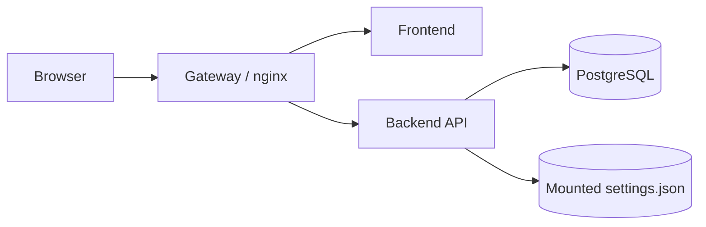
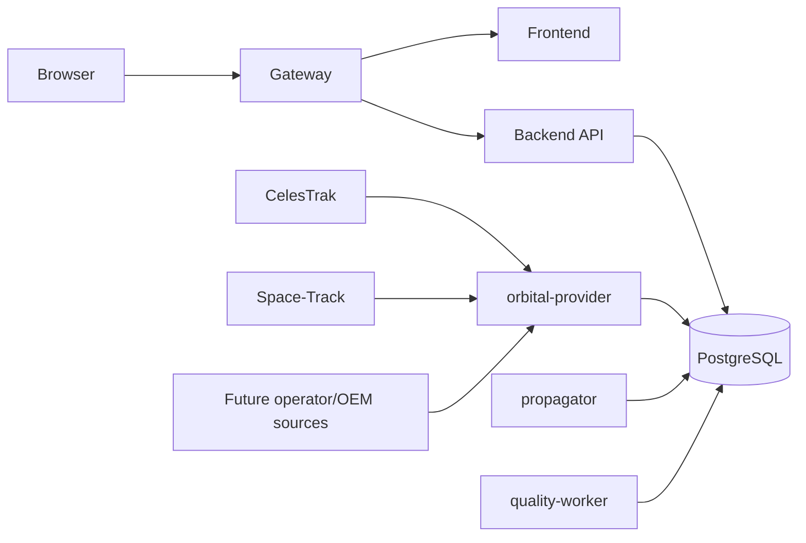
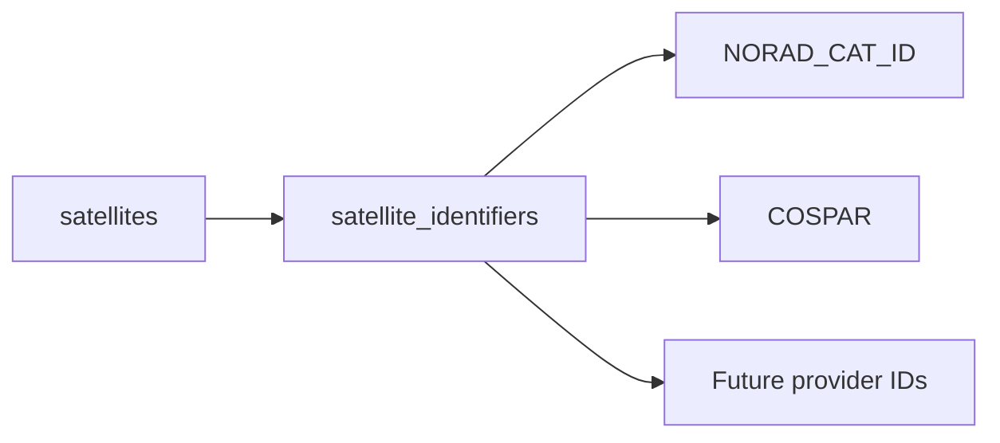
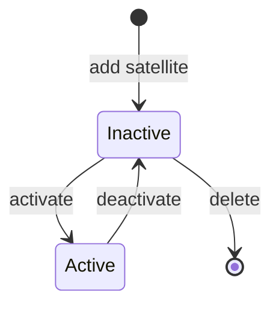
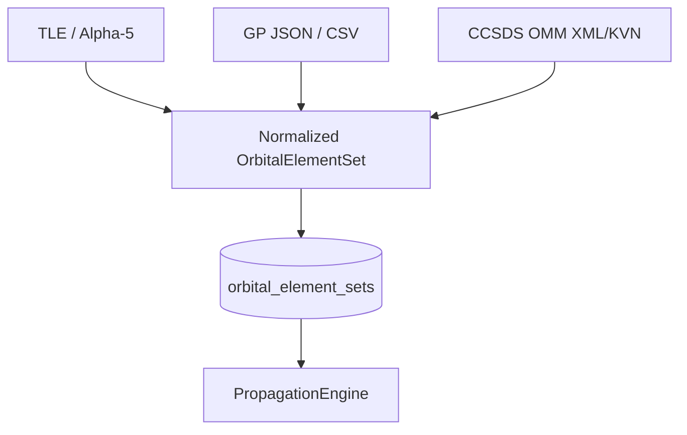
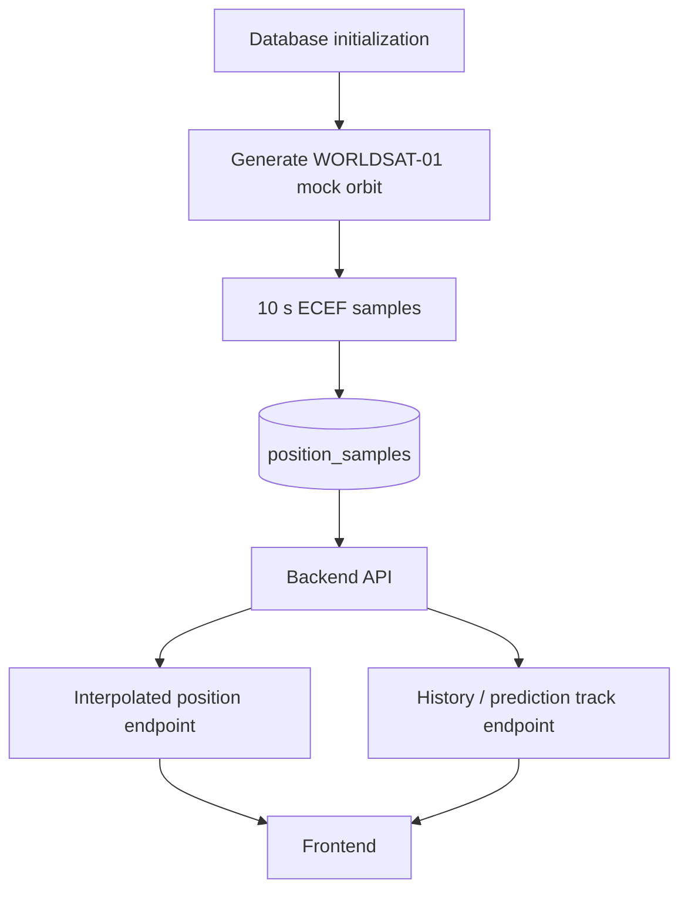
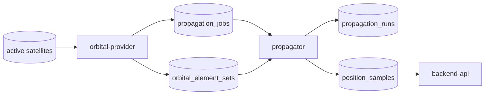

# WorldSat Monitor architecture

WorldSat Monitor separates catalog management, external orbital-data acquisition, propagation, query APIs, and visualization. The boundary is intentional: the UI never becomes an orbit propagator, the user-facing backend never becomes a scheduled provider worker, and orbital workers never depend on browser state.

## Runtime topology

Current development topology:



Target production topology:



One PostgreSQL service remains the initial durable store. Service separation does not require premature distributed databases or message brokers. PostgreSQL can also act as the initial propagation-job queue with row locking such as `FOR UPDATE SKIP LOCKED`.

## Satellite identity and lifecycle

A WorldSat Monitor satellite has an internal database ID. External identities are attributes, not primary keys.



Monitoring state is persisted independently from runtime map selection:



Inactive means metadata and history are retained but scheduled provider/propagation work is disabled. Active means the provider service should keep current source data and the propagator should maintain configured predictions once those services are available. Deactivation never deletes orbital history.

## Orbital source model

The pre-#12 schema treated a two-line TLE record as the domain object. The canonical model is now an orbital element set with OMM/GP-compatible fields:



`orbital_element_sets` stores source provenance, source format, mean-element theory, SGP4-relevant mean elements, optional provider fingerprint, and the original provider payload. TLE lines may exist inside `raw_payload` for a migrated or TLE-sourced record, but `line1`/`line2` are not required database columns.

## Legacy schema migration

When the backend starts against the previous TLE-centric schema, it performs one in-place transactional migration before mock seeding:

```text
satellites.norad_id -> satellite_identifiers[NORAD_CAT_ID]
tle_sets -> orbital_element_sets (source_format=TLE, raw_payload={line1,line2})
propagation_runs.source_tle_id -> source_element_set_id
propagation_jobs.tle_id -> element_set_id
prediction_error_daily.reference_tle_id -> reference_element_set_id
```

The migration runs only when the legacy table exists and the generalized table does not. CI executes the migration against a real PostgreSQL legacy fixture and verifies data/reference preservation.

## Current mock-orbit flow



Mock propagation runs use `source_element_set_id = NULL`, allowing the API/rendering path to stay stable while the real provider and propagator are built.

## Planned provider and propagation flow



Provider responsibilities are fetch, normalization, provenance, change detection and job enqueueing. It does not calculate trajectories or serve browser requests. The propagator owns orbital computation behind a `PropagationEngine` abstraction; SGP4 is the first planned implementation.

## Backend API ownership

The backend owns client-facing application operations: satellite CRUD, activate/deactivate lifecycle transitions, position/track queries and decimation, settings, and future group/quality queries. It does not fetch provider data or perform scheduled propagation inline.

Position and track compatibility endpoints currently resolve the displayed mock satellite by its `NORAD_CAT_ID`. Management endpoints use the internal satellite ID, keeping the domain model independent from the external catalog identifier.

## Frontend ownership

The frontend owns visualization and user interaction. The satellite panel includes local catalog management: list active and inactive satellites, add metadata/identifiers manually, activate/deactivate monitoring, and delete inactive entries. Runtime display selection remains separate from persisted monitoring state.

## Position interpolation and rendering boundary

Interpolation remains Cartesian ECEF rather than longitude interpolation, avoiding discontinuities at the ±180 degree meridian. The frontend never derives authoritative orbital state; rendering-only subdivision may add visual vertices between backend samples but does not alter the orbital solution.

`GROUND` mode uses surface placement and horizon clipping. `ORBIT` mode preserves actual altitude/depth so trajectory segments disappear only when Earth physically occludes them. Satellite marker occlusion uses a finite camera-to-satellite ray/sphere test.

## Prediction quality

Prediction-quality records reference generalized orbital element sets rather than TLE rows. A later GP/OMM set remains an estimate, not ground truth. `reference_kind` and element-set provenance allow future OEM/operator/GNSS references without changing the basic quality model.

## CI contract

`develop` and `main` both run CI. The development gate includes frontend lint/build/tests/artifact validation, backend compile/unit tests, a real PostgreSQL migration from the legacy TLE schema, full Compose startup, schema assertions proving TLE lines are not canonical columns, satellite CRUD/lifecycle checks, and the existing mock position/track/settings checks.

Features remain on `develop` until this integration path is stable, then merge to `main`.
