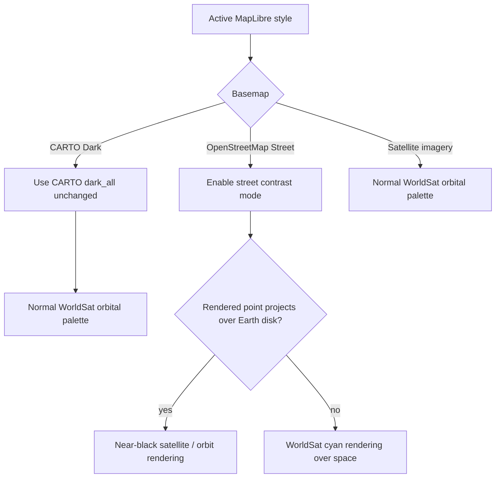
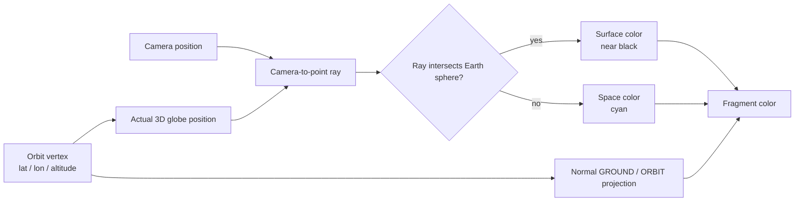
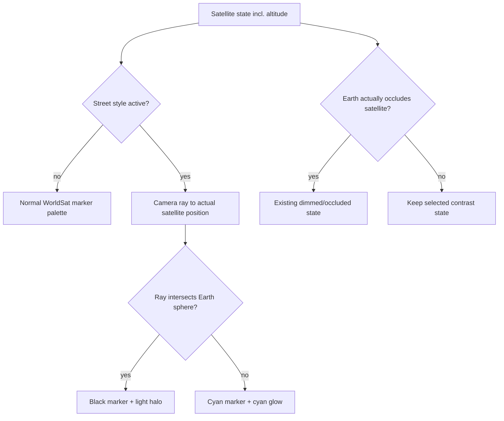

# Basemap orbital contrast

WorldSat Monitor keeps orbital state independent from basemap styling. Basemap-specific logic is used only when presentation requires additional contrast.

## Display policy

## Dark basemap

The Dark option uses the original CARTO `dark_all` raster tiles with no application color grading. Earlier experiments with overlays, raster hue rotation, brightness/contrast adjustments, and a replacement vector style were removed.

This is intentional. CARTO Dark already provides a restrained grey/black background that keeps the satellite marker and trajectory palette visually dominant. The application therefore leaves its raster colors, luminance, boundaries, and labels unchanged.

## Street-map orbit contrast

Street tiles are much brighter than the dark and satellite scenes. Cyan trajectory geometry can disappear against roads, water, and labels. The required rule is visual rather than geographic: geometry that is projected over the Earth disk is black; geometry projected over the surrounding space background is cyan.

The orbit shader evaluates that rule from the **actual elevated trajectory point**, not from its nadir. For each vertex it constructs the camera ray to the 3D point and tests that ray against the unit Earth sphere.

This distinction matters near the limb. An elevated orbit point may already be visibly outside the Earth silhouette while its nadir still belongs to the visible hemisphere. Nadir-based coloring therefore produced black trajectory arcs floating outside the globe. Camera-ray/sphere intersection instead switches color at the projected globe silhouette.

Earth occlusion remains independent. In `ORBIT` mode the elevated trajectory still uses `projectTileFor3D` and the Earth depth buffer, so far-side geometry remains occluded exactly as before. On flat Mercator projection there is no globe silhouette; Street is treated entirely as map surface and uses black rendering.

## Satellite marker contrast

The DOM satellite marker follows the same projected-overlap rule as the WebGL trajectory:

The light halo around the black Street marker keeps the core and label readable over dark road labels or boundaries while retaining black as the primary on-map color.

## Ownership

- `frontend/app/maps/styles.ts` owns basemap construction; CARTO Dark is intentionally unmodified.
- `frontend/app/maps/theme.ts` owns shared display colors and detection of the active Street style.
- `OrbitTrackLayer.ts` owns per-fragment Street trajectory contrast using camera-ray/sphere overlap.
- `satelliteProjection.ts` computes the equivalent projected Earth-disk overlap for the DOM marker.
- `SatelliteLayer.tsx` maps that result to marker CSS classes.

No backend samples, TLE-derived states, interpolation values, altitudes, or prediction data are modified by this feature.
