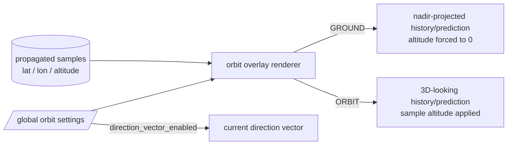
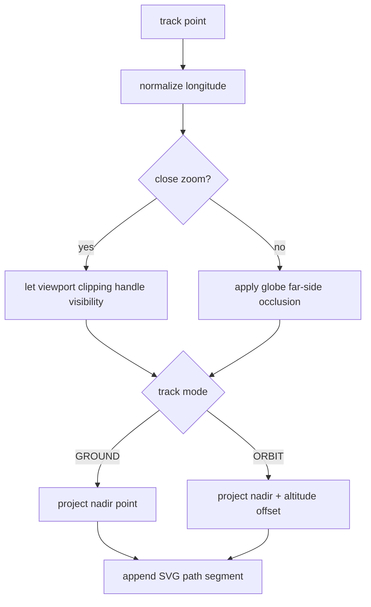

# Orbit display rendering

This document describes the frontend orbit-overlay modes and the persistent settings that control them.

## Display modes



`GROUND` shows where the satellite path projects onto the Earth surface. `ORBIT` uses each propagated sample's altitude and the same rendered-altitude model used by the satellite marker, so the marker and track remain visually aligned.

The direction vector is independent of path visibility. Disabling `DRAW ORBIT PATHS` hides history and prediction while `DRAW DIRECTION VECTOR` may remain enabled.

## Zoom-safe overlay rendering

The orbit overlay is an SVG layer projected from geographic samples on every map render.



Screen-space distance is deliberately not used to decide whether consecutive samples are discontinuous. At close zoom a valid 60-second sample interval can span more than the viewport width; treating that as a jump caused the renderer to lift the pen repeatedly and made paths disappear. Dateline crossings and globe far-side occlusion are the only geometric discontinuities applied.

## Persistent settings

Settings schema version 3 adds the orbit placement mode and direction-vector visibility:

```json
{
  "version": 3,
  "orbit": {
    "direction_vector_enabled": true,
    "position_update_ms": 1000,
    "path": {
      "enabled": true,
      "mode": "ground",
      "history_minutes": 90,
      "prediction_hours": 6,
      "resolution_seconds": 60,
      "refresh_seconds": 30
    }
  }
}
```

Version 1 and version 2 settings are migrated automatically. Existing path/update values are retained; new fields default to `direction_vector_enabled=true` and `mode="ground"`.
