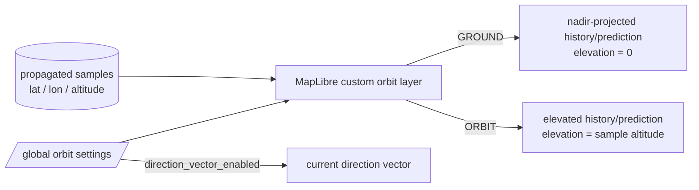
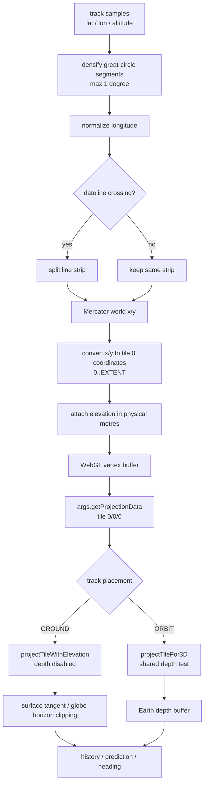
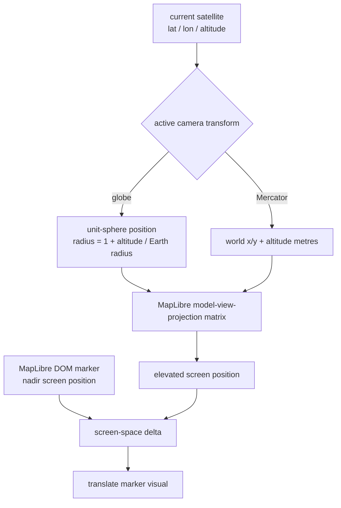
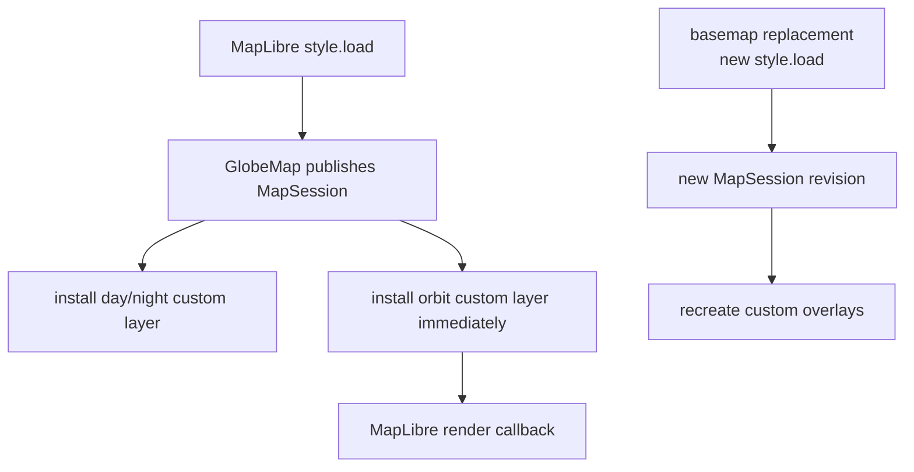
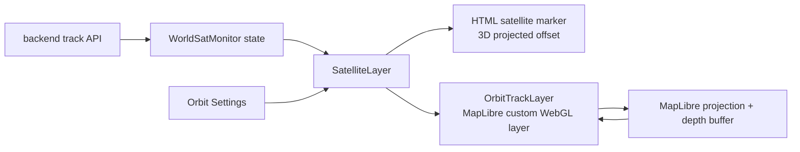

# Orbit display rendering

This document describes the frontend orbit-rendering modes and the persistent settings that control them.

## Display modes



`GROUND` shows where the satellite path projects onto the Earth surface. `ORBIT` keeps the propagated altitude and renders the actual elevated trajectory.

The custom layer is declared as `renderingMode = "3d"` so MapLibre makes its shared globe depth buffer available. The two track modes then deliberately use different visibility models:

- `GROUND` is rendered as a surface overlay with `projectTileWithElevation(...)` and depth testing disabled. Surface-horizon clipping is appropriate because every point lies on the Earth.
- `ORBIT` is rendered with `projectTileFor3D(...)` while retaining MapLibre's depth test. The Earth depth buffer therefore hides only the portion actually behind the planet. Elevated trajectory segments may remain visible beyond the surface tangent until the Earth physically occludes them.

The direction vector is independent of path visibility and follows the selected track placement mode.

## Projection and occlusion pipeline



The orbit renderer uses tile-local geometry for the base `0/0/0` tile plus projection data obtained through `args.getProjectionData(...)`.

For this contract, elevation is supplied in **physical metres**. The same geometry therefore works with both MapLibre's globe and Mercator shader variants without application-side screen-space altitude scaling.

`projectTileWithElevation(...)` intentionally replaces clip-space Z with MapLibre's globe-horizon value. This is useful for surface features but is not physically correct for an orbit because a spacecraft can be visible above and beyond the surface horizon. `projectTileFor3D(...)` preserves the real projected Z, allowing the already-rendered Earth to provide the correct occlusion through the shared depth buffer.

The orbit layer disables depth writes in ORBIT mode while retaining depth testing. This lets the Earth occlude the trajectory without allowing the trajectory itself to pollute the shared scene depth buffer.

Backend samples are subdivided for rendering along great-circle arcs so consecutive custom-layer vertices are never more than roughly one angular degree apart. This is display-only interpolation and does not change authoritative backend orbit states.

Dateline crossings are split before drawing. Prediction and direction-vector dash patterns use cumulative physical path distance rather than screen pixels.

## Satellite marker altitude

The HTML marker remains anchored by MapLibre at the satellite's nadir longitude/latitude, but the visible marker is offset to the **true projected satellite position** instead of using the old radial pixel approximation.



The globe branch uses the same sphere-axis convention as MapLibre and the same active globe model-view-projection matrix used by the 3D orbit path. The Mercator branch uses MapLibre world coordinates plus physical altitude metres. As a result, the current marker, heading-vector origin, history endpoint, and prediction origin all share the same physical altitude model.

Marker far-side dimming remains based on finite camera-to-satellite ray/sphere intersection, so the marker only becomes occluded when the Earth is actually between the camera and spacecraft.

## Custom-layer lifecycle

`GlobeMap` publishes a `MapSession` from its `style.load` callback. That session is the lifecycle boundary used by custom overlays.



Once a `MapSession` exists, the orbit layer is installed immediately with `map.addLayer(...)`. It must **not** call `map.isStyleLoaded()` and then wait for another `style.load` event: the event that produced the session has already occurred, so that extra gate can leave the orbit layer permanently uninstalled.

The `styleRevision` carried by `MapSession` causes React to recreate custom layers after a basemap replacement, because MapLibre removes custom layers together with the previous style.

## Runtime diagnostics

`OrbitTrackLayer` reports whether the custom layer has reached a successful draw, which shader projection variant is active, how many vertices exist in each geometry set, and the latest WebGL/shader error if rendering fails.

With Scene Debug enabled, a healthy renderer should show:

```text
ORBIT RENDER    READY
ORBIT SHADER    GLOBE       # MERCATOR after the close-zoom projection switch
ORBIT VERTICES  <nonzero H> · <nonzero P> · <nonzero V>
ORBIT ERROR     --
```

If the API contains track points but `ORBIT RENDER` is `MISSING`, the renderer has failed rather than the track being empty. `ORBIT SHADER = PENDING` with non-zero vertices means the custom layer has not reached its render callback; this is specifically an installation/lifecycle failure, not a geometry or shader-projection failure.

## Rendering ownership



Orbital data remains owned by the backend. The frontend only decides how already-propagated state is visualized.

## Persistent settings

Settings schema version 3 adds orbit placement mode and direction-vector visibility:

```json
{
  "version": 3,
  "orbit": {
    "direction_vector_enabled": true,
    "position_update_ms": 1000,
    "path": {
      "enabled": true,
      "mode": "ground",
      "history_minutes": 90,
      "prediction_hours": 6,
      "resolution_seconds": 60,
      "refresh_seconds": 30
    }
  }
}
```

Older settings schemas are migrated automatically.
