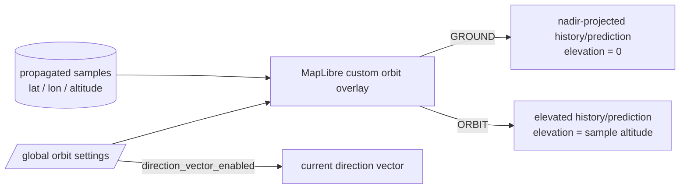
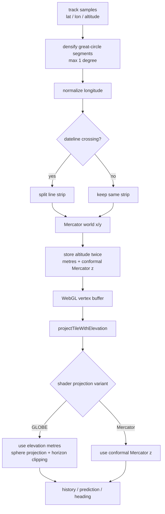
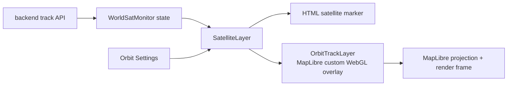

# Orbit display rendering

This document describes the frontend orbit-rendering modes and the persistent settings that control them.

## Display modes



`GROUND` shows where the satellite path projects onto the Earth surface. `ORBIT` keeps the propagated altitude and sends it through MapLibre's globe-aware `projectTileWithElevation` projection path.

The orbit renderer is intentionally a **2D custom overlay layer with elevated vertices**, not a depth-sharing 3D custom layer. The path must remain readable above the basemap while still using MapLibre's globe projection and horizon clipping. Declaring it as a 3D layer and then disabling depth testing produced an inconsistent rendering contract and could make all orbit lines disappear at runtime.

The direction vector is independent of path visibility. Disabling `DRAW ORBIT PATHS` hides history and prediction while `DRAW DIRECTION VECTOR` may remain enabled.

## Projection pipeline

The orbit path is no longer projected into screen coordinates by application code.



MapLibre's shader projection variants use different elevation coordinate systems. Under the globe variant, elevation is physical metres above the sphere. Under the Mercator variant, elevation is conformal Mercator z in the same world-coordinate domain as x/y. Each rendered vertex therefore carries both representations and the shader selects the appropriate one at compile time for the active projection variant.

The previous screen-space renderer projected each point to 2D and then simulated altitude by moving that pixel radially away from the apparent globe centre. That approximation caused close-zoom spurious lines and ORBIT paths that bent around the camera focus point. That code path is no longer used.

Backend samples are subdivided for rendering along great-circle arcs so consecutive custom-layer vertices are never more than roughly one angular degree apart. This is display-only interpolation. It does not alter the stored propagation cadence or create new authoritative orbit states.

Dateline crossings are split before drawing because normalized world-Mercator x wraps from 1 back to 0 there. Prediction and direction-vector dash patterns use cumulative physical path distance rather than screen pixels, so their logical cadence does not change with zoom.

## Rendering ownership



Orbital data remains owned by the backend. The frontend custom layer only decides how the already-propagated state is visualized.

## Persistent settings

Settings schema version 3 adds the orbit placement mode and direction-vector visibility:

```json
{
  "version": 3,
  "orbit": {
    "direction_vector_enabled": true,
    "position_update_ms": 1000,
    "path": {
      "enabled": true,
      "mode": "ground",
      "history_minutes": 90,
      "prediction_hours": 6,
      "resolution_seconds": 60,
      "refresh_seconds": 30
    }
  }
}
```

Version 1 and version 2 settings are migrated automatically. Existing path/update values are retained; new fields default to `direction_vector_enabled=true` and `mode="ground"`.
