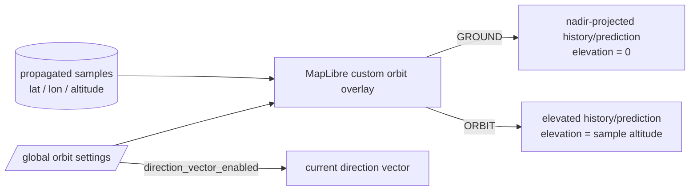
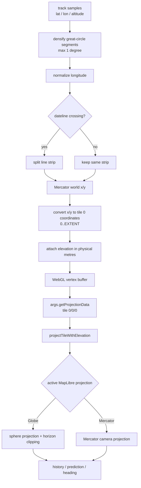
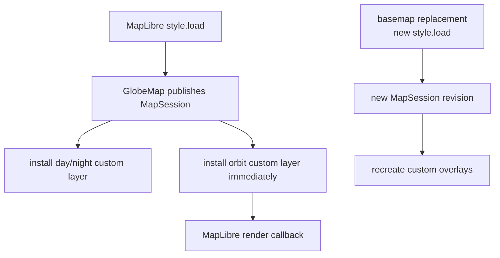
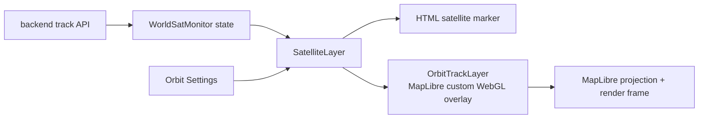

# Orbit display rendering

This document describes the frontend orbit-rendering modes and the persistent settings that control them.

## Display modes



`GROUND` shows where the satellite path projects onto the Earth surface. `ORBIT` keeps the propagated altitude and sends it through MapLibre's globe-aware `projectTileWithElevation` projection path.

The orbit renderer is intentionally a **2D custom overlay layer with elevated vertices**, not a depth-sharing 3D custom layer. The direction vector is independent of path visibility.

## Projection pipeline



The orbit renderer uses the same projection contract as the existing day/night shadow layer: tile-local geometry for the base `0/0/0` tile plus projection data obtained through `args.getProjectionData(...)`.

For this contract, elevation is supplied in **physical metres**. MapLibre 6.1.0's Mercator custom-layer matrix rescales its Z axis by `worldSize / pixelsPerMeter`, while the globe shader converts elevation metres into radius above the unit sphere. Application code therefore does not maintain a second conformal-Z representation.

Backend samples are subdivided for rendering along great-circle arcs so consecutive custom-layer vertices are never more than roughly one angular degree apart. This is display-only interpolation and does not change authoritative backend orbit states.

Dateline crossings are split before drawing. Prediction and direction-vector dash patterns use cumulative physical path distance rather than screen pixels.

## Custom-layer lifecycle

`GlobeMap` publishes a `MapSession` from its `style.load` callback. That session is the lifecycle boundary used by custom overlays.



Once a `MapSession` exists, the orbit layer is installed immediately with `map.addLayer(...)`. It must **not** call `map.isStyleLoaded()` and then wait for another `style.load` event: the event that produced the session has already occurred, so that extra gate can leave the orbit layer permanently uninstalled.

The `styleRevision` carried by `MapSession` causes React to recreate custom layers after a basemap replacement, because MapLibre removes custom layers together with the previous style.

## Runtime diagnostics

`OrbitTrackLayer` reports whether the custom layer has reached a successful draw, which shader projection variant is active, how many vertices exist in each geometry set, and the latest WebGL/shader error if rendering fails.

With Scene Debug enabled, a healthy renderer should show:

```text
ORBIT RENDER    READY
ORBIT SHADER    GLOBE       # MERCATOR after the close-zoom projection switch
ORBIT VERTICES  <nonzero H> · <nonzero P> · <nonzero V>
ORBIT ERROR     --
```

If the API contains track points but `ORBIT RENDER` is `MISSING`, the renderer has failed rather than the track being empty. `ORBIT SHADER = PENDING` with non-zero vertices means the custom layer has not reached its render callback; this is specifically an installation/lifecycle failure, not a geometry or shader-projection failure.

## Rendering ownership



Orbital data remains owned by the backend. The frontend custom layer only decides how already-propagated state is visualized.

## Persistent settings

Settings schema version 3 adds orbit placement mode and direction-vector visibility:

```json
{
  "version": 3,
  "orbit": {
    "direction_vector_enabled": true,
    "position_update_ms": 1000,
    "path": {
      "enabled": true,
      "mode": "ground",
      "history_minutes": 90,
      "prediction_hours": 6,
      "resolution_seconds": 60,
      "refresh_seconds": 30
    }
  }
}
```

Older settings schemas are migrated automatically.
