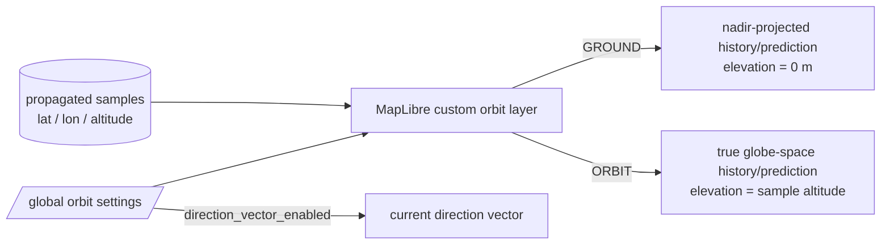
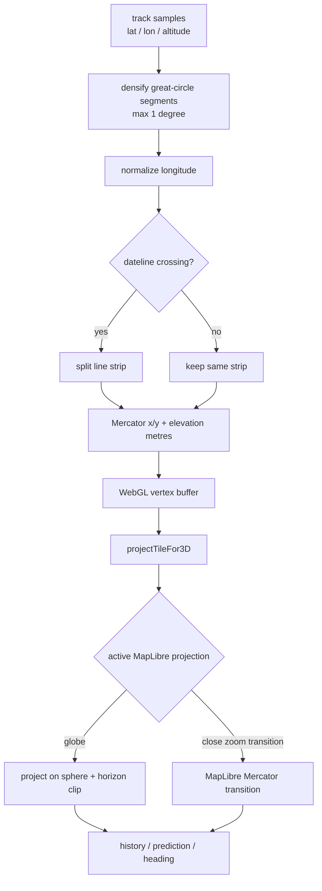
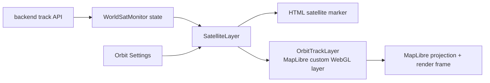

# Orbit display rendering

This document describes the frontend orbit-rendering modes and the persistent settings that control them.

## Display modes



`GROUND` shows where the satellite path projects onto the Earth surface. `ORBIT` sends each propagated sample's real altitude in metres through MapLibre's `projectTileFor3D` projection path. The renderer therefore uses the same globe shape, camera, horizon clipping, and globe-to-Mercator zoom transition as the basemap itself.

The direction vector is independent of path visibility. Disabling `DRAW ORBIT PATHS` hides history and prediction while `DRAW DIRECTION VECTOR` may remain enabled.

## Projection pipeline

Orbit paths are a MapLibre 3D custom layer rather than an SVG screen-space approximation.



The previous renderer projected each point onto the 2D screen first and then simulated altitude by moving that point radially away from the apparent globe centre. That approximation had two failure modes:

1. close zoom could connect distant projected samples through unrelated parts of the viewport, producing spurious lines;
2. ORBIT mode distorted trajectories around the current camera/focus point because the artificial radial offset was defined in screen space rather than Earth-centred 3D space.

The custom layer removes both assumptions. Geographic points remain geographic until MapLibre performs the final projection. Dateline crossings are still split before drawing because world-Mercator coordinates wrap from 1 back to 0 there.

Backend samples are also subdivided for rendering along great-circle arcs so consecutive custom-layer vertices are never more than roughly one angular degree apart. This is a display-only interpolation step. It does not alter the stored propagation cadence or create new authoritative orbit states.

Prediction and direction-vector dash patterns are generated from cumulative physical path distance rather than screen pixels. This keeps their semantics stable while zooming.

## Rendering ownership



Orbital data remains owned by the backend. The frontend custom layer only decides how the already-propagated state is visualized.

## Persistent settings

Settings schema version 3 adds the orbit placement mode and direction-vector visibility:

```json
{
  "version": 3,
  "orbit": {
    "direction_vector_enabled": true,
    "position_update_ms": 1000,
    "path": {
      "enabled": true,
      "mode": "ground",
      "history_minutes": 90,
      "prediction_hours": 6,
      "resolution_seconds": 60,
      "refresh_seconds": 30
    }
  }
}
```

Version 1 and version 2 settings are migrated automatically. Existing path/update values are retained; new fields default to `direction_vector_enabled=true` and `mode="ground"`.
